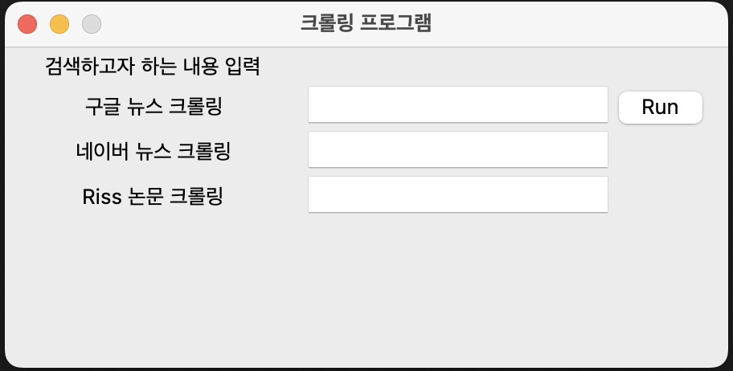
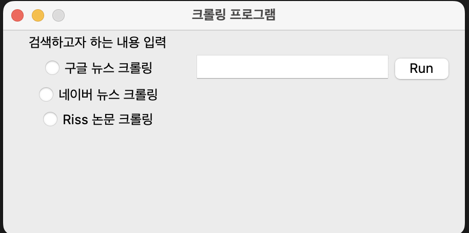
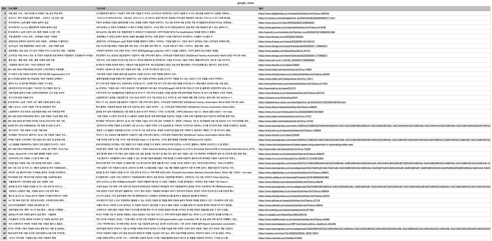
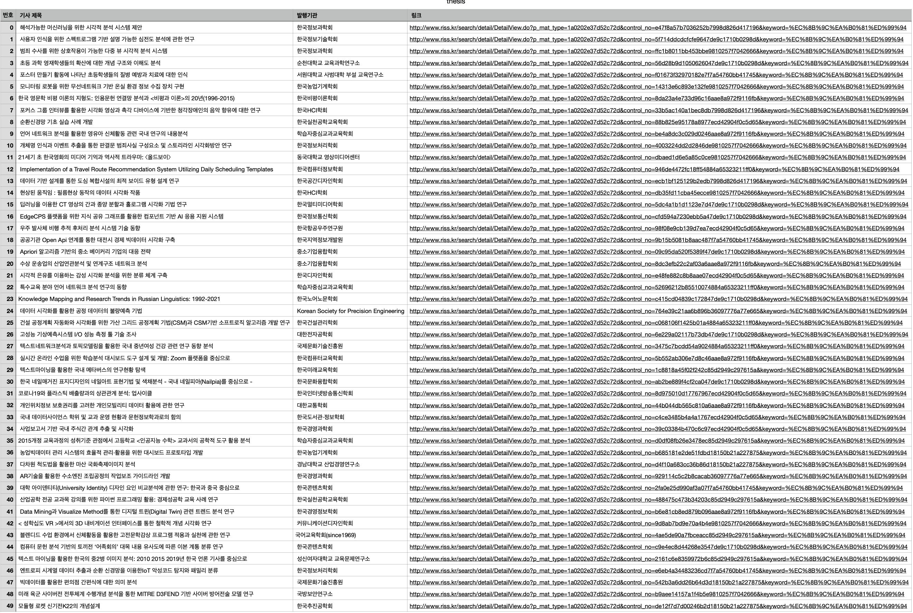

# News-Thesis_Crawling

### 데이터 수집을 위한 크롤링을 진행한다.
tkinter 패키지를 통해 UI를 구축하며 입력받은 내용을 기반으로 뉴스의 기사를 저장하고자 한다.  
또한 해당 기술을 논문 검색에도 적용하여 필요한 논문의 정보를 찾아 정리할 수 있도록 한다.    

#### 사용 패키지
selenium : webdriver관리를 통한 데이터 수집
- pip3 install selenium

Tkinter : Python UI 구성
 - brew install python-tk 

|기간|내용|
|------|---|
|2023.2.6|구글, 네이버에 대한 검색어를 입력 받아 최근 50개의 기사 정보를 가져온다.|
|   |제목, 요약, 링크 3가지 항목을 구성.|
|   |riss 의 국내 논문 이동.|
|2023.2.7|riss 메인페이지에서 팝업창으로 인한 오류 발생.|
|   |riss 검색창으로 바로 연결하여 문제 해결|
|   |검색시 국내학술논문의 연도순 정렬로 1~5페이지 까지의 논문 제목, 발행기관, 링크를 csv파일로 저장한다.|
|2023.2.9|UI 정리.|
|   |각각 분리된 기능을 라디오 버튼으로 묶어서 선택된 데이터만 크롤링 하도록 수정|

## UI

## 수집한 데이터

